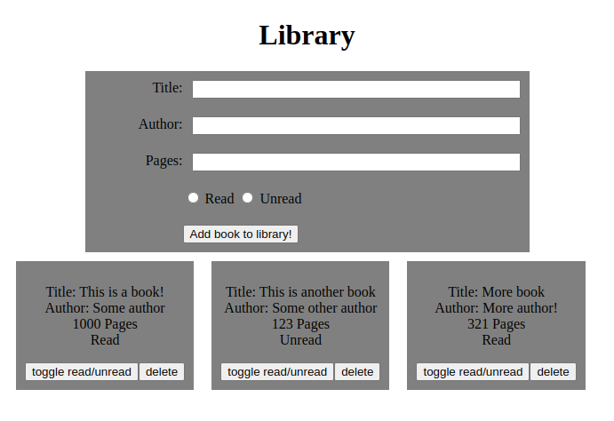

# odin-project-library
This is the "Library" project from TheOdinProject's JavaScript course. My wife loves books! So she liked the idea of this project a lot!

**Link to project:** https://www.andyglover.io/odin-project-library/

## How It's Made:

**Tech used:** HTML, CSS, JavaScript

(project in progress, pardon the dust.)

This project lets you fill out a form with information about a book, then click a button to add that book to a card on the screen. Each book card has a button to delete the book, and to toggle whether the book is "Read" or "Unread".

## Optimizations

The Odin Project called for another button which would "pop up" the form when the user wanted to add a book, so I would like to add that in the future.

Also a trash can icon, and confirmation dialogue for deleting a book would be a nice feature.

## Lessons Learned:

In building this project, I learned how to make use of constructors, and work with objects, adding methods to them, and using the "this" keyword.

This was also some good practice with appending elements to the page, and adding buttons to those elements that do things!

I also got to make use of the "data-" attribute in this one!

## Examples:
Here's a few more repositories of mine you might like to check out:

**Calculator:** https://github.com/andyglover/odin-calculator

**Rock Paper Scissors:** https://github.com/andyglover/odin-rock-paper-scissors

**GIF Thingy:** https://github.com/andyglover/gif-thingy

**Admin Dashboard:** https://github.com/andyglover/odin-project-admin-dashboard

**ANDYGLOVER.IO:** https://github.com/andyglover/andyglover.github.io

**ANDYGLOVER.DEV:** https://github.com/andyglover/andyglover.dev