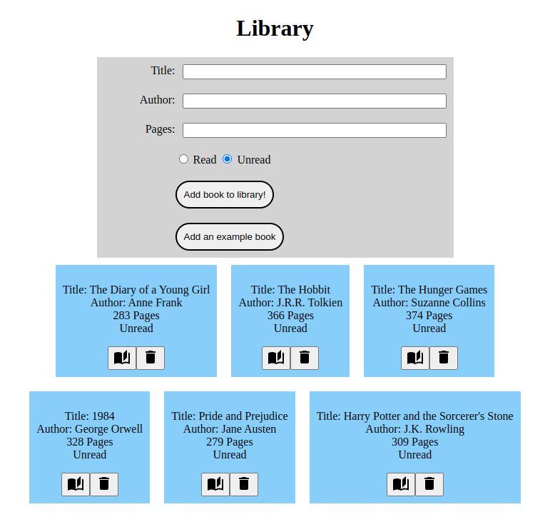

# odin-project-library
This is the "Library" project from TheOdinProject's JavaScript course. Still working on this one!

**Link to project:** http://recruiters-love-seeing-live-demos.com/

## How It's Made:

**Tech used:** HTML, CSS, JavaScript

This project is gonna test my Javascript skills, I'm sure of it!

## Optimizations

I think I'll have a better idea of what optimizations I'd like to make after I complete this project.

## Lessons Learned:

I think I'll have a better idea of what lessons I've learned after I complete this project.

## Examples:
Here's a few more repositories of mine you might like to check out:

**Calculator:** https://github.com/andyglover/odin-calculator

**Rock Paper Scissors:** https://github.com/andyglover/odin-rock-paper-scissors

**GIF Thingy:** https://github.com/andyglover/gif-thingy

**Admin Dashboard:** https://github.com/andyglover/odin-project-admin-dashboard

**ANDYGLOVER.IO:** https://github.com/andyglover/andyglover.github.io

**ANDYGLOVER.DEV:** https://github.com/andyglover/andyglover.dev